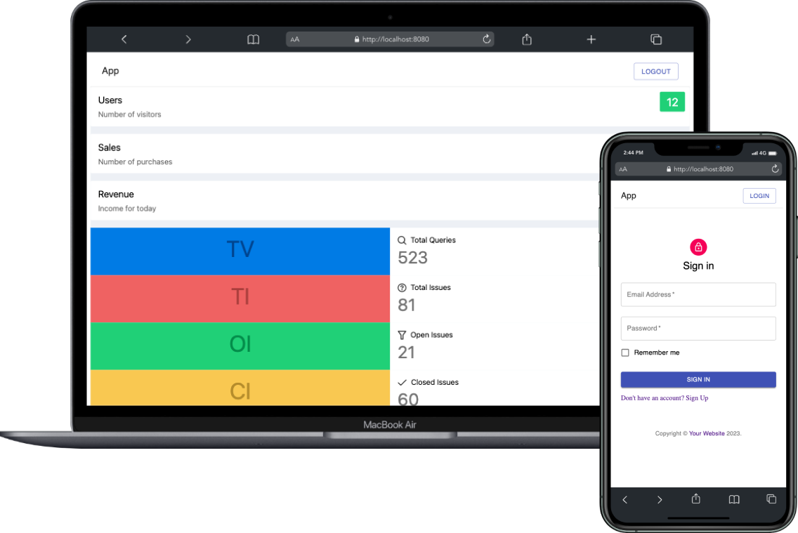

### @micro-frontend application

A micro frontend applications to showcase Webpack 5 Module Federation plugin, and handle multiple modules with share dependencies.

<div style="text-align: center;">
  
</div>

### Table of contents

- [App Architecture](#app-architecture)
- [Technical Resources](#technical-resources)

## App Architecture

The project has three sub-applications using the concept of micro frontend, moreover, we've another application shell named `container` for handling whether we should or not show other apps, all these modules are managed by `Module Federation` plugin, from `Webpack 5`. As you can see below:

```
  .
  |
  |__ packages
    |
    |__ container
    |__ auth
    |__ dashboard
    |__ marketing
```

## Technical Resources

- Micro-frontend architecture with mono-repo
- `Github Actions` workflows for automatically deploy each MFE (Micro-frontend)
- Use of `Module Federation` plugin for managing applications
- Use of `Amazon S3` and `Cloud Front` (CDN)
- Callback communication between apps
- Lazy load app modules
- React and Vue based applications
- `React Router DOM` for handling browser and memory routers
